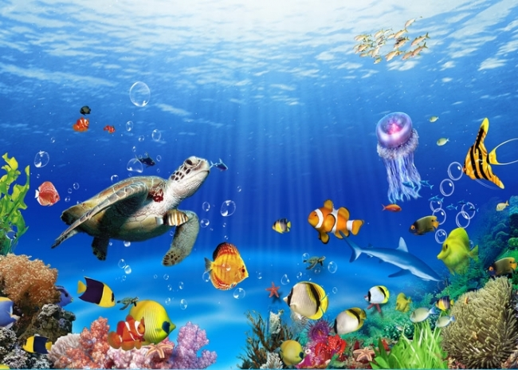
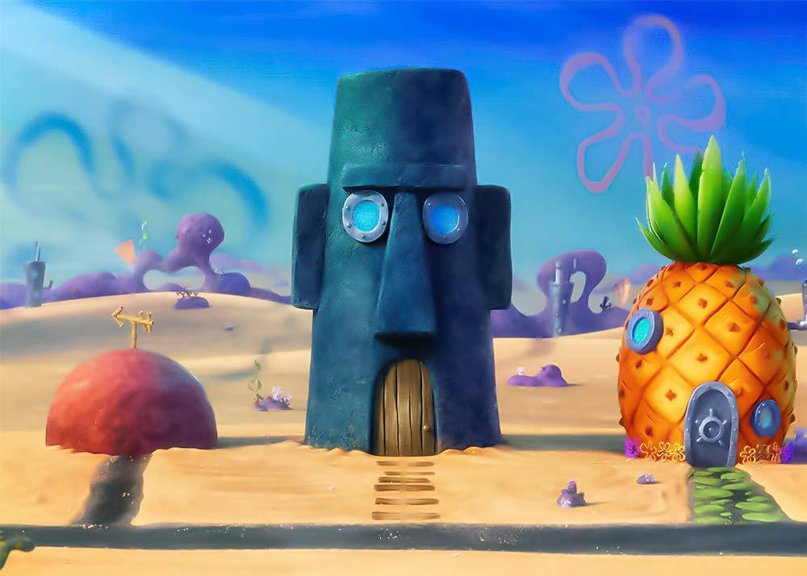

# 🐟🧽 Dijital Balık Müzesi

---
# 🎓 Akademik Bilgiler

**Üniversite:** Fırat Üniversitesi

**Ders:** YMGK

**Proje Türü:** Artırılmış Gerçeklik (AR) Tabanlı Mobil Uygulama
---

# 👩‍💻 Geliştirici

**ŞEHED HATİB**

Öğrenci No: 220541608

---

## 📖 Proje Hakkında

Dijital Balık Müzesi, çocuklara yönelik geliştirilmiş artırılmış gerçeklik (AR) tabanlı eğitsel bir mobil uygulamadır.

Uygulama, çocukların deniz canlılarını daha eğlenceli ve etkileşimli bir şekilde öğrenmelerini amaçlamaktadır. Sistem, kamera aracılığıyla belirlenen hedef görselleri algılar ve ilgili 3D içerikleri artırılmış gerçeklik ortamında görüntüler.


Proje iki farklı AR deneyimi sunmaktadır:

🐟 **Balık Müzesi**

🧽 **SüngerBob Dünyası**


**Bu proje bana aittir ve tüm sorumluluk benimdir (Tek kişilik proje).**


---

# 🎯 Projenin Amacı

- Çocuklara balık türlerini öğretmek
- Görsel öğrenmeyi desteklemek
- Artırılmış gerçeklik teknolojisini eğitim alanında kullanmak
- Eğitimi daha eğlenceli hale getirmek
- Kullanıcı etkileşimini artırmak

---

# 🐟 Balık Müzesi Bölümü

Kamera balık müzesi hedef görseline tutulduğunda:

- Çeşitli balık türleri 3D olarak görüntülenir.
- Kullanıcı balıklara dokunabilir.
- Balık hakkında bilgiler ekranda gösterilir.
- Balığın tehlike altında olup olmadığı öğrenilebilir.
- Kullanıcı farklı balık türlerini inceleyebilir.

Bu bölüm çocukların deniz canlılarını tanımalarını ve öğrenmelerini amaçlamaktadır.

---

# 🧽 SüngerBob Dünyası

Kamera SüngerBob temalı hedef görsele tutulduğunda:

- SüngerBob karakterleri 3D olarak görüntülenir.
- Karakterler sesli olarak kendilerini tanıtır.
- Tanıtım sonrasında kullanıcıya bir soru sorulur.
- Mini quiz ekranı açılır.
- Kullanıcı iki seçenek arasından cevap verir.

Bu bölüm, çocukların uygulamayla daha fazla etkileşim kurmasını ve öğrenirken eğlenmesini amaçlamaktadır.

---

# 🎮 Quiz Sistemi

SüngerBob karakterleri kullanıcıya kısa sorular yöneltmektedir.

### ✅ Doğru Cevap

Skor +1

### ❌ Yanlış Cevap

Skor -1

Skor değeri uygulama içerisinde anlık olarak güncellenmektedir.

Bu sistem çocukların öğrendiklerini pekiştirmelerine yardımcı olmaktadır.

---

# 🛠 Kullanılan Teknolojiler

| Teknoloji | Açıklama |
|------------|------------|
| Unity | Oyun motoru |
| C# | Programlama dili |
| Vuforia Engine | Görsel tanıma ve AR sistemi |
| Android | Hedef mobil platform |
| Augmented Reality (AR) | Artırılmış gerçeklik teknolojisi |

---

# ⚙️ Çalışma Mantığı

```text
Kamera Açılır
      ↓
Hedef Görsel Algılanır
      ↓
Vuforia Tanıma İşlemi
      ↓
3D İçerik Gösterilir
      ↓
Kullanıcı Etkileşimi
```

---

# 📂 Proje Yapısı

```text
Assets/
│
├── 3D Modeller
├── Scriptler
├── Ses Dosyaları
├── Görseller

Packages/
ProjectSettings/
UserSettings/
Documentation/
Videos/
QCAR/
```

---

# 💻 Sistem Gereksinimleri

Projeyi çalıştırmak için:

- Unity Hub
- Unity 2022.3.62f3
- Android Build Support
- Vuforia Engine

---

# 📊 Teknik Değerlendirme

Proje aşağıdaki teknik kriterler doğrultusunda değerlendirilmiştir:

- Çalışan modül oranı: %100
- Gerçek ortam testi: Android cihazlarda başarıyla test edilmiştir.
- Hata toleransı: Hedef görsel algılanmadığında uygulama kararlı şekilde çalışmaya devam etmektedir.
- Kullanıcı doğrulaması: Kullanıcı testleri gerçekleştirilmiş ve olumlu geri bildirimler alınmıştır.
- Performans metriği: AR içerikleri akıcı ve kararlı şekilde görüntülenmektedir.

---
## 📋 Trello Board

Proje geliştirme süreci aşağıdaki Trello panosu üzerinden takip edilmiştir.

🔗 Trello Link:
https://trello.com/b/UJDZrCmb/my-trello-board


---

## 📱 APK İndirme Bağlantısı

Uygulamanın hızlı ve kolay şekilde test edilebilmesi için hazır APK dosyası aşağıdaki bağlantıdan indirilebilir:

🔗  https://drive.google.com/drive/folders/1HFjKkMXcYMJxgZ5kXXoG7l2XPNy471Lm?usp=sharing

---

# 📥 Ek Dosyalar

GitHub dosya boyutu sınırları nedeniyle bazı dosyalar depoya eklenmemiştir.

Aşağıdaki bağlantıda:

- Vuforia paketi
- Balık Müzesi hedef görseli
- SüngerBob hedef görseli

bulunmaktadır.

🔗 İndirme Bağlantısı:

https://drive.google.com/drive/folders/1HFjKkMXcYMJxgZ5kXXoG7l2XPNy471Lm?usp=sharing

---
## 🖼 AR Hedef Görselleri

### 🐟 Balık Müzesi Hedef Görseli

Bu görsel algılandığında balık türleri görüntülenir ve kullanıcı balıklar hakkında bilgi alabilir.



---

### 🧽 SüngerBob Hedef Görseli

Bu görsel algılandığında SüngerBob karakterleri görüntülenir ve quiz sistemi aktif hale gelir.



---

# 🚀 Projeyi Çalıştırma

Uygulama herhangi bir mobil cihazda doğrudan çalışıyor.

1. Projeyi GitHub üzerinden indiriniz.
2. Unity Hub ile projeyi açınız.
3. Unity 2022.3.62f3 sürümünü kullanınız.
4. Gerekirse Vuforia paketini projeye ekleyiniz.
5. Android cihaz üzerinde Build alınız veya APK dosyasını yükleyiniz.
6. Uygulama açıldıktan sonra hedef görselleri kameraya göstererek AR deneyimini başlatınız.

---
## 🔧 Projeyi Geliştirmek ve Düzenlemek

Projede değişiklik yapmak isteyen geliştiriciler aşağıdaki adımları takip edebilir:

1. Projeyi GitHub üzerinden indiriniz.
2. Unity Hub kurunuz.
3. Unity 2022.3.62f3 sürümünü yükleyiniz.
4. Projeyi Unity ile açınız.
5. Vuforia paketini ekleyiniz.
6. Assets klasörü içerisindeki scriptleri ve sahneleri düzenleyiniz.
7. Yeni hedef görseller veya 3D modeller ekleyiniz.
8. Android Build alarak değişiklikleri test ediniz.

---
# 🌊 Sonuç

Dijital Balık Müzesi, artırılmış gerçeklik teknolojisini eğitimle birleştiren interaktif bir mobil uygulamadır.

Proje sayesinde çocuklar balık türlerini öğrenebilmekte, SüngerBob karakterleri ile etkileşime geçebilmekte ve quiz sistemi aracılığıyla bilgilerini eğlenceli bir şekilde test edebilmektedir.

Bu proje, artırılmış gerçeklik teknolojisinin eğitim alanında etkili bir şekilde kullanılabileceğini gösteren örnek bir uygulamadır.
